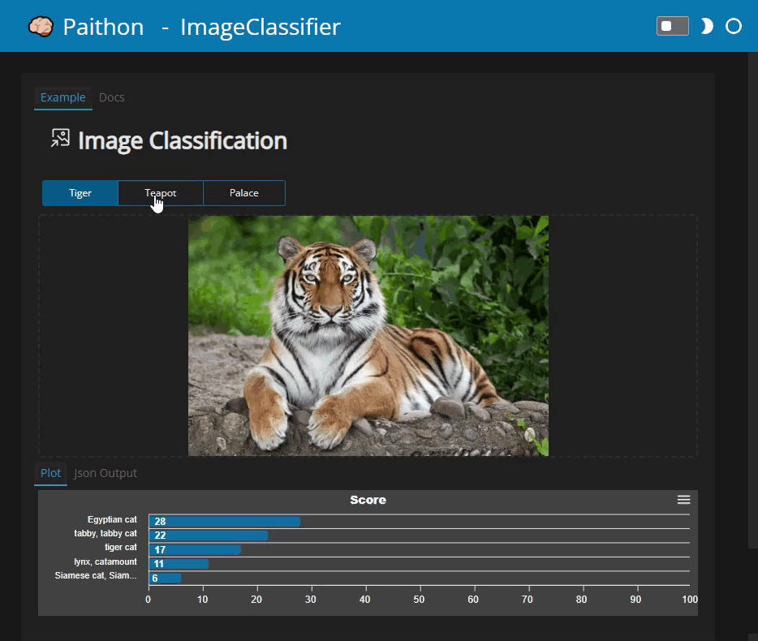

[](https://pypi.org/project/paithon/) [](https://pepy.tech/project/paithon)   

[](https://twitter.com/MarcSkovMadsen)

# &#129504; Paithon

PRE-ALPHA STATE

**Make your AI models interactive in no time**. Easy to use examples and components for the Jupyter Notebook, your favorite Editor/ IDE and your next AI App.

*Paithon* is **Panel AI Tools with Humor ON**. Get started now!

| Jupyter Labs | Apps |
| - | - |
| [](https://mybinder.org/v2/gh/marcskovmadsen/paithon/HEAD?urlpath=lab/tree/examples) | [](https://mybinder.org/v2/gh/marcskovmadsen/paithon/HEAD?urlpath=panel) |



## 🏃 Getting Started

With `pip`

```bash
pip install paithon
```

From within a Jupyter Notebook

```python
import paithon as pa
import panel as pn

pn.extension()
```

### 👩‍🏫 Reference Guides

| Guide | Notebook | Jupyter Labs | Apps |
| - | - | - | - |
| DocStringViewer | [View](https://github.com/MarcSkovMadsen/paithon/blob/master/examples/reference/shared/pane/DocStringViewer.ipynb) | [](https://mybinder.org/v2/gh/marcskovmadsen/paithon/HEAD?urlpath=lab/tree/examples/reference/shared/pane/DocStringViewer.ipynb) | [](https://mybinder.org/v2/gh/marcskovmadsen/paithon/HEAD?urlpath=panel/DocStringViewer) |
| ImageInput | [View](https://github.com/MarcSkovMadsen/paithon/blob/master/examples/reference/image/widgets/ImageInput.ipynb) | [](https://mybinder.org/v2/gh/marcskovmadsen/paithon/HEAD?urlpath=lab/tree/examples/reference/image/widgets/ImageInput.ipynb) | [](https://mybinder.org/v2/gh/marcskovmadsen/paithon/HEAD?urlpath=panel/ImageInput) |

## 🏁 Background

I believe that Panel is a very flexible and powerful tool compared to the other python ML app frameworks out there. I believe it can give you and your AI team super powers.

So I started this project to help you and the Panel framework. As a bonus I will learn more about AI.

## ⚖️ License

The `paithon` package and repository is open source and free to use (MIT License).

## 💡 Inspiration

I find inspiration at

- [Hugging Face Widgets](https://github.com/huggingface/huggingface_hub/tree/main/widgets)
- [Gradio](https://gradio.app/)
- [Panel](https://panel.holoviz.org)

## 🛣️ Roadmap

When I get the time I would like to

- Support common workflows in ML and DL.
- Implement Panel versions of the Hugging Face widgets
- Show that Panel can easily do what Gradio can and so much more.
- Add badges for 100% test coverage etc.
- Distribute as conda package

## 📰 Change Log

- 0.0.3: Fix some broken links
- 0.0.2: Add ImageInput and DocStringViewer
- 0.0.1: First Version
